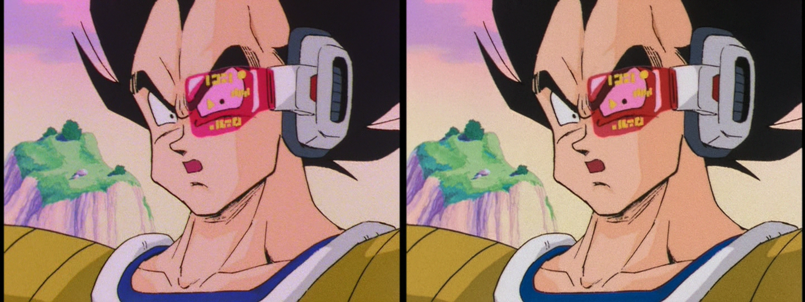
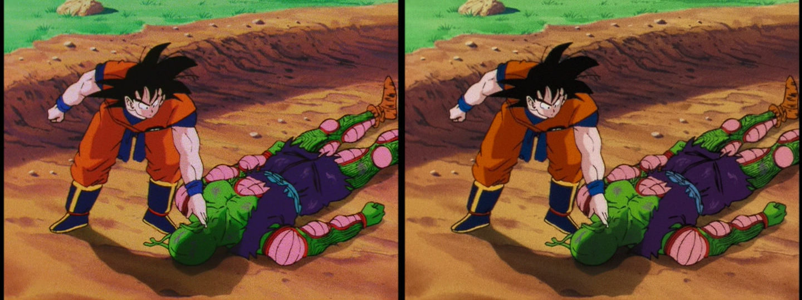
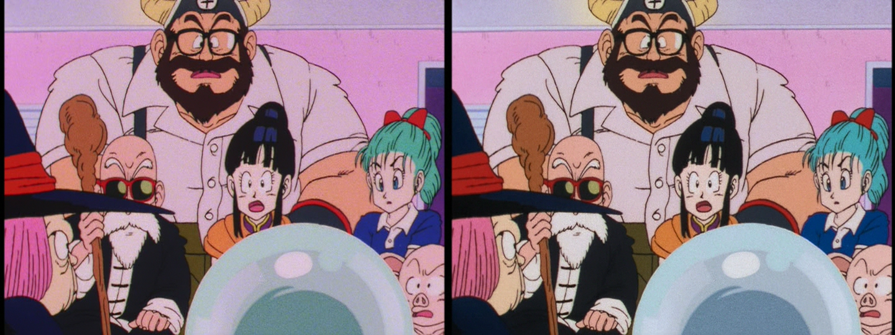

Simple script to create color grading / color correction presets and export them to a 3DLUT. The goal is to then use it on videos.

Capabilities and qualities:
 - white-balance when testing on images;
 - hue-to-hue maps for dark and bright tones separately;
 - functions use the cylindrical CIEluv colorspace, which focus on keeping the same perceived luminosity of each color after hue shifts; 
 - saturation map with respect to brightness;
 - lightness map with respect to brightness;
 - locally boost or decrease the lightness within an interval of hue and lightness;
 - locally boost or decrease the saturation within an interval of hue and lightness;
 - considerably good performance;

# Usage
Change the parameters in arguments.py to tweak the colors. The presets are all given by RGB and HSV/L values, since these are very simple to colorpick and understand. The HSV/L (range: hue from 0° to 360°, saturation and value/lightness from 0% to 100%) numbers are all converted to cylindrical CIEluv.
Run
 > python makeLUT.py

to generate a new LUT file in .cube format. This will ignore any white-balance presets in arguments.py. Ideally, you should apply the LUTs generated by this script on footage that's already white-balanced.
To test on an image, run
 > python makeLUT.py --test=/path/to/image.png

on your terminal.

### Apply the 3DLUT to video:
If you use any video editor, you should be able to import the 3DLUT file with ease.
Here I included the vapoursynth script cc.py to accomplish this. To avoid artefacting due to possible extreme transformations the 3DLUT might do, a fast denoiser is applied to separate any noise or film grain from the footage. The noise is added back to the video after the color correction, and finally a deband filter is applied.
To preview the cc.py script, run on your terminal:
 > ./vspipepreview.sh /path/to/video.mp4
 
You can edit vspipepreview.sh to pipe the script to a raw y4m file or to ffmpeg to get a proper encode.

# Examples:
 ( untouched           **|**           white-balance + 3DLUT exported by the script )

